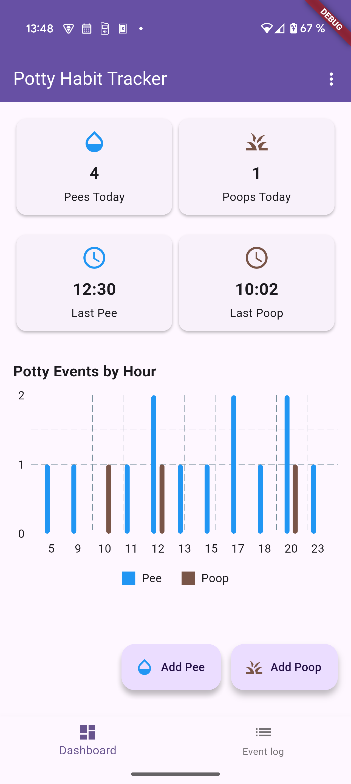
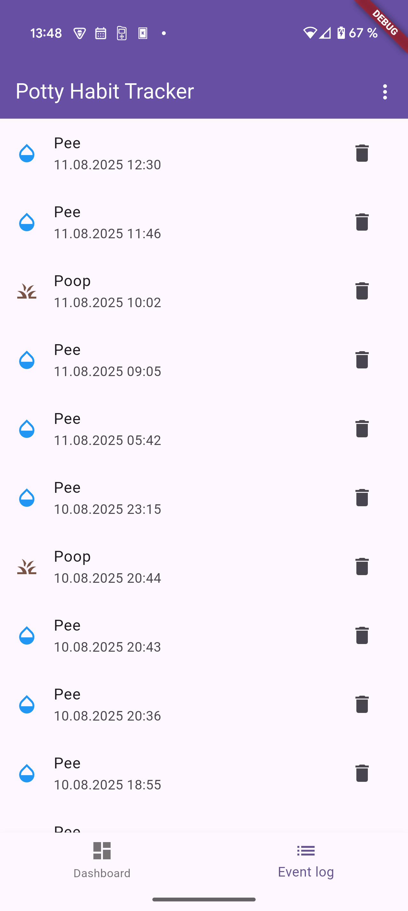

<h1 align="center">Potty Habit Tracker</h1>

Flutter app for Android to track your pups potty habits.
 
 
Built with ❤︎ by LegendaryB

 

## 🎯 Motivation
I wanted a simple app without the need to create some account to track the poo and pee times of my pupy Yuki, because I wanted to know if she really needs to go or if she only wants something else from me.

## 🚀 Features
* Quick view tiles (last pee, last poo, total pee's, total poo's)
* Quick add via floating action buttons
* Histogram
* Event listview
* Data is locally saved to SQLite file.
* Import from JSON
* Export to JSON

## 🌠 Preview

    
    

